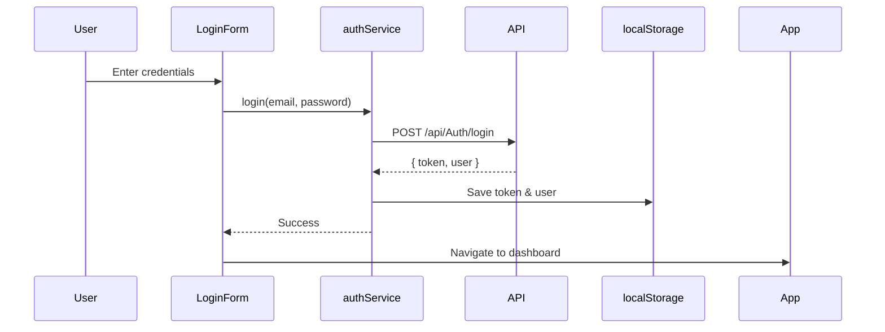

# 🔌 API Integration Complete!

## ✅ Đã hoàn thành

Dự án đã được tích hợp hoàn toàn với **EVehicleManagementAPI v1.0**.

### 📦 Files đã tạo

```
src/
├── configs/
│   └── axios.js ........................... ✅ Updated with interceptors
├── services/
│   ├── index.js ........................... ✅ Central exports
│   ├── authService.js ..................... ✅ Authentication
│   ├── postService.js ..................... ✅ Posts management
│   ├── batteryService.js .................. ✅ Battery operations
│   ├── vehicleService.js .................. ✅ Vehicle operations
│   ├── batteryModelService.js ............. ✅ Battery models
│   ├── vehicleModelService.js ............. ✅ Vehicle models
│   ├── paymentService.js .................. ✅ Payment processing
│   ├── packageService.js .................. ✅ Post packages
│   ├── postRequestService.js .............. ✅ Buyer/Seller requests
│   ├── memberService.js ................... ✅ Member management
│   └── constructService.js ................ ✅ Service constructs
└── constants/
    └── apiConstants.js .................... ✅ All enums & constants

Documentation/
├── API_INTEGRATION_GUIDE.md ............... ✅ Full integration guide
├── API_QUICK_REFERENCE.md ................. ✅ Quick reference
└── API_EXAMPLES.md ........................ ✅ Component examples

Config/
├── .env.example ........................... ✅ Updated with API URL
```

## 🚀 Quick Start

### 1. Cấu hình Environment

```bash
# Copy .env.example to .env
cp .env.example .env

# Edit .env
VITE_API_BASE_URL=https://localhost:59212
```

### 2. Sử dụng trong Component

```javascript
// Import services
import { authService, postService, batteryService } from "@/services";
import { POST_STATUS, PAYMENT_METHOD } from "@/constants/apiConstants";

// Login
const response = await authService.login({ email, password });

// Get posts
const posts = await postService.getPosts({ page: 1, pageSize: 10 });

// Create post
const newPost = await postService.createPost({
  title: "Pin xe máy điện",
  price: 5000000,
  postType: "Battery",
});
```

### 3. Protected Routes

```javascript
import { authService } from "@/services";

const ProtectedRoute = ({ children }) => {
  if (!authService.isAuthenticated()) {
    return <Navigate to="/login" />;
  }
  return children;
};
```

## 📚 Documentation

| File                         | Description                                                                   |
| ---------------------------- | ----------------------------------------------------------------------------- |
| **API_INTEGRATION_GUIDE.md** | 📖 Hướng dẫn đầy đủ về tích hợp API, authentication flow, error handling      |
| **API_QUICK_REFERENCE.md**   | ⚡ Tham khảo nhanh các services và cách sử dụng                               |
| **API_EXAMPLES.md**          | 💡 Ví dụ cụ thể tích hợp vào LoginForm, ProductsPage, CustomerDashboard, etc. |

## 🎯 API Services

### Authentication (`authService`)

- ✅ Login / Register / Staff Login
- ✅ Change Password / Forgot Password
- ✅ OTP Verification
- ✅ Google OAuth
- ✅ Auto token management

### Posts (`postService`)

- ✅ CRUD operations
- ✅ Get featured posts
- ✅ Filter by member, status, type
- ✅ Assign staff to post

### Battery & Vehicle

- ✅ `batteryService` - Battery CRUD & search
- ✅ `vehicleService` - Vehicle CRUD
- ✅ `batteryModelService` - Models & filters
- ✅ `vehicleModelService` - Models & filters

### Transactions

- ✅ `postRequestService` - Buyer/Seller negotiations
- ✅ `paymentService` - Payment processing
- ✅ `packageService` - Post packages subscription

### Others

- ✅ `memberService` - Member management
- ✅ `constructService` - Service constructs

## 🔐 Authentication Flow



## 🌐 API Endpoints Coverage

| Module           | Endpoints | Status  |
| ---------------- | --------- | ------- |
| **Auth**         | 12/12     | ✅ 100% |
| **Post**         | 9/9       | ✅ 100% |
| **Battery**      | 7/7       | ✅ 100% |
| **Vehicle**      | 5/5       | ✅ 100% |
| **Payment**      | 11/11     | ✅ 100% |
| **PostRequest**  | 12/12     | ✅ 100% |
| **Member**       | 6/6       | ✅ 100% |
| **Construct**    | 13/13     | ✅ 100% |
| **PostPackage**  | 9/9       | ✅ 100% |
| **BatteryModel** | 5/5       | ✅ 100% |
| **VehicleModel** | 5/5       | ✅ 100% |

**Total: 94/94 endpoints** ✅

## 🎨 Constants Available

```javascript
import {
  POST_STATUS, // Active, Pending, Sold, Expired
  POST_TYPE, // Battery, Vehicle, Both
  TRANSACTION_TYPE, // DIRECT, STAFF_ASSISTED
  PAYMENT_STATUS, // Pending, Completed, Failed
  PAYMENT_METHOD, // BankTransfer, MoMo, VNPay
  MEMBER_STATUS, // Active, Inactive, Suspended
  ROLE, // Admin, Staff, Customer
  BATTERY_CONDITION, // Excellent, Good, Fair, Poor
  VEHICLE_CONDITION, // New, LikeNew, Good, Fair
  BATTERY_CHEMISTRY, // Lithium-Ion, LiPo, NiMH
  VEHICLE_TYPE, // Motorcycle, Scooter, Car
} from "@/constants/apiConstants";
```

## 🛠 Features

### Axios Configuration

- ✅ Base URL from environment
- ✅ Request interceptor (auto JWT token)
- ✅ Response interceptor (error handling)
- ✅ 10s timeout
- ✅ Auto logout on 401

### Error Handling

- ✅ 401 → Auto logout & redirect to login
- ✅ 403 → Forbidden message
- ✅ 404 → Not found
- ✅ 500 → Server error
- ✅ Network errors

### Token Management

- ✅ Auto save on login
- ✅ Auto attach to requests
- ✅ Auto clear on logout
- ✅ Check authentication status

## 📝 Next Steps

### 1. Test API Connection

```javascript
// Test in browser console or component
import { postService } from "@/services";

const test = async () => {
  try {
    const posts = await postService.getPosts();
    console.log("Success:", posts);
  } catch (error) {
    console.error("Error:", error);
  }
};
```

### 2. Update Components

| Component         | Service                          | Status                |
| ----------------- | -------------------------------- | --------------------- |
| LoginForm         | `authService.login()`            | 🔄 Ready to integrate |
| RegisterForm      | `authService.register()`         | 🔄 Ready to integrate |
| ProductsPage      | `postService.getPosts()`         | 🔄 Ready to integrate |
| CustomerDashboard | `postService.getPostsByMember()` | 🔄 Ready to integrate |
| StaffDashboard    | `postRequestService`             | 🔄 Ready to integrate |
| PackagesPage      | `packageService`                 | 🔄 Ready to integrate |
| PaymentPage       | `paymentService`                 | 🔄 Ready to integrate |

### 3. Add Loading States

```javascript
const [loading, setLoading] = useState(false);
const [error, setError] = useState(null);

try {
  setLoading(true);
  const data = await postService.getPosts();
  // Handle success
} catch (err) {
  setError(err.message);
} finally {
  setLoading(false);
}
```

### 4. Create ProtectedRoute

```javascript
// See API_EXAMPLES.md for full code
<Route
  path="/customer"
  element={
    <ProtectedRoute>
      <CustomerPage />
    </ProtectedRoute>
  }
/>
```

## 🔍 API Testing

### Swagger UI

```
https://localhost:59212/swagger
```

### Swagger JSON

```
https://localhost:59212/swagger/v1/swagger.json
```

### Database

```
Server: SQL Server
Database: EVehicleDB
```

## 🆘 Troubleshooting

### CORS Issues

Backend cần enable CORS cho frontend origin

### SSL Certificate

Nếu localhost HTTPS có vấn đề, thử HTTP:

```env
VITE_API_BASE_URL=http://localhost:59212
```

### Token Not Working

Check localStorage:

```javascript
console.log("Token:", localStorage.getItem("accessToken"));
console.log("User:", localStorage.getItem("user"));
```

### API Not Responding

1. Check backend đang chạy
2. Check URL trong .env
3. Check network tab trong DevTools

## 📞 Support

- 📖 Read: `API_INTEGRATION_GUIDE.md`
- ⚡ Quick ref: `API_QUICK_REFERENCE.md`
- 💡 Examples: `API_EXAMPLES.md`

---

**Created**: November 3, 2025  
**API Version**: 1.0  
**Database**: EVehicleDB  
**Swagger**: https://localhost:59212/swagger

**Status**: ✅ **READY FOR INTEGRATION**
